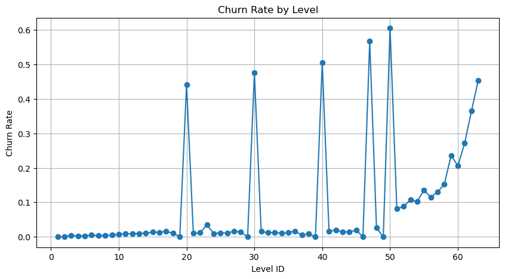
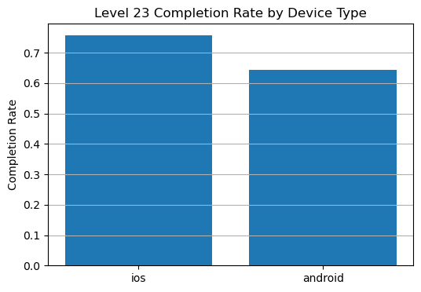
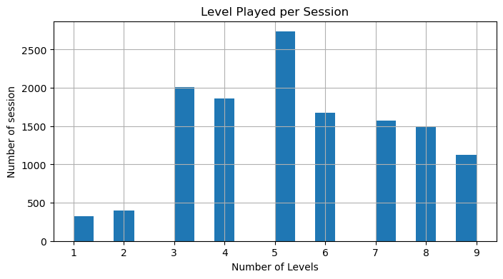

# 🎮 Game Churn & Player Progression Analysis

This project analyzes player behavior and churn patterns in a mobile puzzle game using progression data.

The goal is to identify problem levels, understand session behavior, and compare platform performance to improve player retention.

---

## 📌 Project Overview

This case study focuses on analyzing:

- Daily active users
- Level progression
- Session distribution
- Player churn by level
- Platform comparison (iOS vs Android)

It helps product teams understand where and why players drop off.

---

## ✨ Features

- ✔️ Daily Active Users (DAU) analysis
- ✔️ Session length distribution
- ✔️ Churn rate calculation by level
- ✔️ Hypothesis testing (iOS vs Android)
- ✔️ Visualization of problem levels
- ✔️ Data-driven recommendations

---

## 🛠️ Technologies Used

- Python 3
- Pandas
- NumPy
- Matplotlib
- SciPy
- Jupyter Notebook

---

## 📂 Project Structure

game-churn-analysis/
│

│ ├── churn_rate_by_level.png
│ ├── level23_ios_android_completion.png
│ └── session_disturbiton.png
│
├── game_churn_analysis.ipynb
├── case_study.ipynb
└── README.md

---

## 📊 Key Visualizations

### 1️⃣ Churn Rate by Level
Identifies levels where players drop out most frequently.



---

### 2️⃣ Level 23 Platform Comparison
Compares completion rates between iOS and Android players.



---

### 3️⃣ Session Distribution
Shows how many levels players complete per session.



---

## 📈 Main Findings

- Major churn spikes occur at levels: 50, 47, 40, 30, and 20.
- Most users complete around 5 levels per session.
- iOS users perform significantly better than Android users on Level 23.
- Late-game levels show increasing player fatigue.

---

## 📑 Hypothesis Testing (Task 4)

A two-sample t-test was conducted on Level 23:

- H₀: No difference between iOS and Android completion rates.
- H₁: A significant difference exists.

Result:
- p-value < 0.05
- H₀ rejected

Conclusion:
Device type affects performance on Level 23.

---

## ✅ Recommendations (Task 5)

### Priority Levels: 50 and 47

#### Level 50
- Highest churn rate
- Possible difficulty spike
- Recommendation:
  - Increase move limit
  - Simplify mechanics
  - Add hints

#### Level 47
- Second highest churn
- Players struggle with objectives
- Recommendation:
  - Improve tutorials
  - Adjust level balance

Both levels should be prioritized for redesign.

---

## 🚀 How to Run

1. Clone the repository:
```bash
git clone https://github.com/username/game-churn-analysis.git
Open the notebook:
jupyter notebook
Run game_churn_analysis.ipynb

📄 License
This project is for educational and case study purposes.
